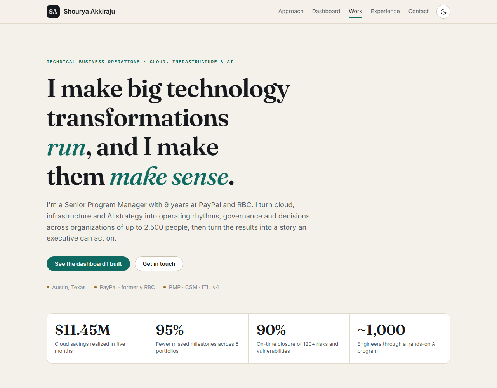
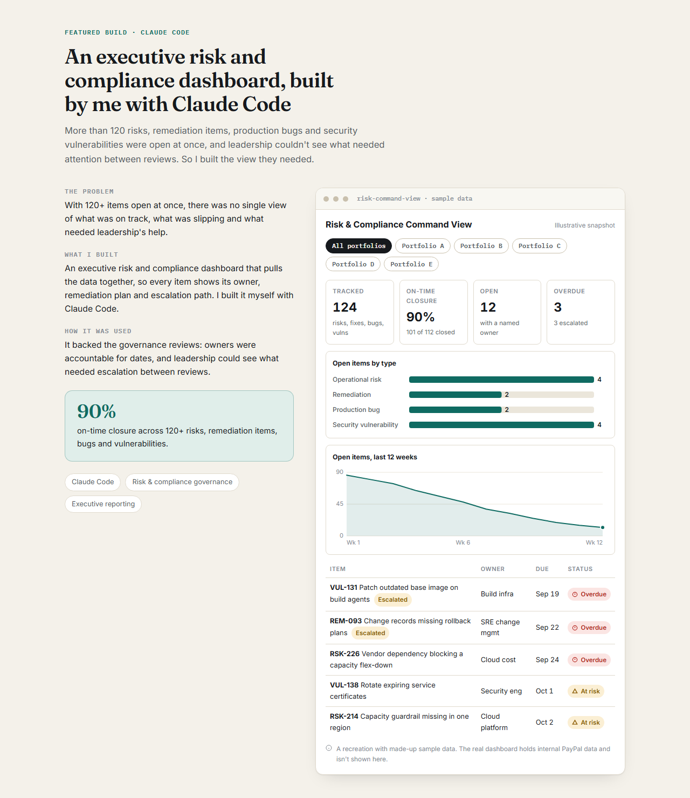
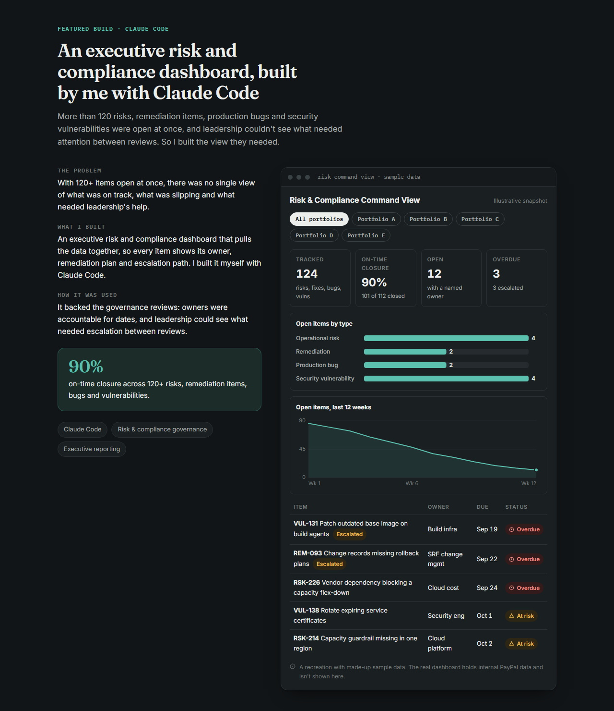
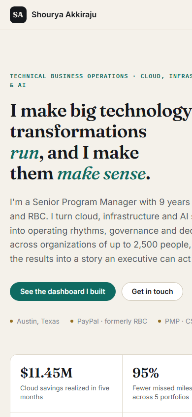
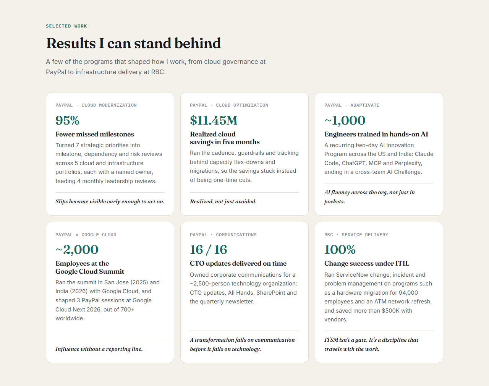

# Shourya Akkiraju | Portfolio

[](https://akkish1.github.io/My-Portfolio/)
[](https://claude.com/claude-code)
[](https://pages.github.com/)

My personal brand site. I'm a Senior Program Manager and Technical Business Operations leader with 9 years at PayPal and RBC. I turn cloud, infrastructure and AI strategy into operating rhythms, governance and decisions, then turn the results into a story an executive can act on.

**👉 View it live: [akkish1.github.io/My-Portfolio](https://akkish1.github.io/My-Portfolio/)**



---

## What's on the site

| Section | What it shows |
|---|---|
| **Hero** | My brand line and four headline results: $11.45M in cloud savings, 95% fewer missed milestones, 90% on-time risk closure and ~1,000 engineers trained in AI |
| **Belief** | How I think about programs: most missed milestones are a visibility problem, not a delivery problem |
| **How I work** | Four pillars, each with proof: strategy into execution, governance that moves numbers, AI adoption, and executive storytelling |
| **Featured build** | A case study of the executive risk and compliance dashboard I built with Claude Code, with an interactive demo |
| **Selected work** | Six programs with the result each one delivered, from PayPal cloud governance to RBC infrastructure delivery |
| **Experience** | My roles at PayPal and RBC, 2017 to now |
| **Credentials** | PMP, ITIL v4, CSM, my degree from York University, and the tools I use |
| **Recommendations** | What senior leaders I've worked with say, plus my RBC top 1% award |
| **Contact** | Email and LinkedIn, and the roles I'm open to |

---

## Featured build: a risk and compliance dashboard built with Claude Code

At PayPal, more than 120 risks, remediation items, production bugs and security vulnerabilities were open at once, and leadership couldn't see what needed attention between reviews. I built an executive risk and compliance dashboard myself with Claude Code, so every item showed its owner, remediation plan and escalation path. It backed our governance reviews and helped us reach **90% on-time closure**.

The site includes an interactive recreation you can click through:

- **KPI tiles:** items tracked, on-time closure, open items and overdue items
- **Open items by type:** operational risks, remediation items, production bugs and security vulnerabilities
- **12-week trend:** open items burning down over time, with a hover tooltip on each week
- **Status table:** the items that need attention, marked Overdue, At risk or On track, with escalations flagged
- **Portfolio filter:** every number and chart updates when you pick a portfolio



> **All dashboard data on this site is synthetic.** The real dashboard runs on internal PayPal data, so this version uses made-up items, owners and numbers so it can be shared publicly. The portfolios are named A to E on purpose.

---

## Light mode, dark mode and mobile

The site follows your device's light or dark setting, and the moon button switches between them. The layout adjusts for phones.

<table>
  <tr>
    <td width="72%"></td>
    <td width="28%"></td>
  </tr>
  <tr>
    <td align="center"><sub>Dark mode</sub></td>
    <td align="center"><sub>Mobile</sub></td>
  </tr>
</table>

---

## Selected work



---

## How it was built

I built this site with **[Claude Code](https://claude.com/claude-code)**, giving it plain-English instructions. It used my resume and brand notes as the source, so every number on the site comes from my real work.

- **No frameworks or build step:** plain HTML, CSS and JavaScript, so it loads fast and runs anywhere
- **Charts drawn by hand in SVG:** no chart library, and the charts redraw at their real size so the text stays readable on any screen
- **Accessible:** status labels use an icon and text, not color alone, and animations turn off for people who prefer reduced motion
- **Hosted free on GitHub Pages:** every change pushed to `main` goes live in about a minute

| File | What it does |
|---|---|
| `index.html` | The page content and structure |
| `styles.css` | Colors, fonts and layout for light mode, dark mode and phones |
| `script.js` | Theme switch, scroll effects, the dashboard demo and its sample data |
| `docs/screenshots/` | The images in this README |

### Run it on your computer

No install needed. Download the repo and open `index.html` in any browser.

```bash
git clone https://github.com/Akkish1/My-Portfolio.git
```

Add `?static` to the address to turn off animations, or `?theme=dark` to force dark mode.

---

## Contact

- **Email:** [shourya.akkiraju@gmail.com](mailto:shourya.akkiraju@gmail.com)
- **LinkedIn:** [linkedin.com/in/shouryaakkiraju](https://www.linkedin.com/in/shouryaakkiraju/)
- **Location:** Austin, Texas

I'm open to Senior Program Manager, Technical Business Operations and program management roles in cloud, infrastructure and AI transformation.
